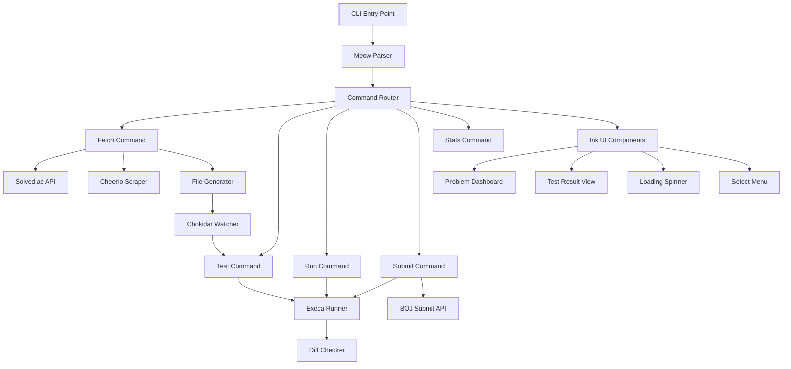

# PS-CLI 개발 계획

## 프로젝트 개요

백준(BOJ) 문제 해결을 위한 통합 CLI 도구로, 문제 가져오기, 로컬 테스트, 제출까지 지원하는 개발 환경을 제공합니다.

## 핵심 아키텍처




## 기술 스택

### 핵심 라이브러리

- **Ink**: React 기반 터미널 UI 프레임워크
- **Meow**: CLI 인자 파싱 및 도움말 생성
- **Execa**: 프로세스 실행 (컴파일 및 실행)
- **Cheerio**: HTML 파싱 (문제 페이지 크롤링)
- **Chokidar**: 파일 감시 (자동 테스트)
- **Conf**: 사용자 설정 저장
- **Chalk**: 터미널 색상
- **Gradient-string**: 그라데이션 텍스트

### 빌드 도구

- **TypeScript**: 타입 안전성
- **tsup**: Zero-config 번들러 (ESM 출력)

## 프로젝트 구조

```javascript
ps-cli/
├── src/
│   ├── index.ts              # CLI 진입점
│   ├── commands/
│   │   ├── fetch.ts          # 문제 가져오기
│   │   ├── test.ts           # 로컬 테스트
│   │   ├── run.ts            # 코드 실행
│   │   ├── submit.ts         # 제출
│   │   └── stats.ts          # 통계
│   ├── services/
│   │   ├── solved-api.ts     # Solved.ac API 클라이언트
│   │   ├── scraper.ts        # BOJ 페이지 크롤링
│   │   ├── file-generator.ts # 파일 생성
│   │   ├── runner.ts         # 코드 실행기
│   │   ├── diff-checker.ts   # 출력 비교
│   │   └── submitter.ts      # 제출 로직
│   ├── components/
│   │   ├── problem-dashboard.tsx  # 문제 정보 대시보드
│   │   ├── test-result.tsx        # 테스트 결과 표시
│   │   ├── spinner.tsx           # 로딩 스피너
│   │   ├── select-menu.tsx        # 문제 선택 메뉴
│   │   └── stats-view.tsx         # 통계 뷰
│   ├── utils/
│   │   ├── config.ts         # 설정 관리
│   │   ├── language.ts       # 언어별 설정
│   │   └── formatter.ts      # 출력 포맷팅
│   └── types/
│       └── index.ts          # 타입 정의
├── templates/
│   ├── solution.js           # JavaScript 템플릿
│   ├── solution.ts           # TypeScript 템플릿
│   ├── solution.py           # Python 템플릿
│   └── solution.cpp          # C++ 템플릿
├── package.json
├── tsconfig.json
├── tsup.config.ts
└── README.md
```


## 단계별 구현 계획

### 1단계: 프로젝트 초기화 및 기본 구조

**목표**: TypeScript + ESM 빌드 환경 구축 및 기본 CLI 구조 생성**작업 내용**:

- bun 사용
- `package.json` 생성 및 의존성 설치
- TypeScript 설정 (`tsconfig.json`)
- tsup 빌드 설정 (`tsup.config.ts`)
- Meow를 사용한 기본 CLI 라우팅 구조
- `src/index.ts` 진입점 생성 (shebang 포함)

**주요 파일**:

- `package.json`: bin 설정, scripts, dependencies
- `src/index.ts`: CLI 진입점 및 명령어 라우팅

### 2단계: 문제 데이터 로직 (Crawler & API)

**목표**: Solved.ac API 연동 및 BOJ 페이지 크롤링**참고 문서**: [Solved.ac 비공식 문서](https://solvedac.github.io/unofficial-documentation/#/)**작업 내용**:

- Solved.ac API 클라이언트 구현 (`services/solved-api.ts`)
- 문제 정보 조회: `GET /api/v3/problem/show?problemId={id}`
- 난이도, 티어, 태그, 제목, 시간/메모리 제한 정보
- 문제 검색: `GET /api/v3/search/problem` (선택적, 추후 확장용)
- 사용자 통계: `GET /api/v3/user/show?handle={handle}` (stats 명령어용)
- API Rate Limit 처리 및 에러 핸들링
- User-Agent 설정 (비공식 API 사용 시 권장)
- BOJ 페이지 스크래퍼 구현 (`services/scraper.ts`)
- Cheerio로 문제 본문, 예제 입력/출력 추출
- `https://www.acmicpc.net/problem/{id}` 페이지 파싱
- 예제 입력/출력 케이스 추출 (여러 개 지원)
- 문제 설명, 입력/출력 형식 파싱
- 파일 생성기 구현 (`services/file-generator.ts`)
- 문제 번호 기반 폴더 생성 (`problems/{문제번호}/`)
- 언어별 템플릿 코드 생성
- `input.txt`, `output.txt` 생성 (각 예제별로 `input1.txt`, `output1.txt` 등)
- `README.md` 생성 (문제 제목, 난이도, 태그 정보 포함)

**주요 파일**:

- `services/solved-api.ts`: Solved.ac API 통신 (비공식 문서 기반)
- `services/scraper.ts`: BOJ 페이지 파싱
- `services/file-generator.ts`: 파일 구조 생성
- `templates/*`: 언어별 템플릿 파일

### 3단계: Ink 기반 인터랙티브 UI

**목표**: 문제 정보 표시 및 사용자 인터랙션 UI 구현**작업 내용**:

- `problem-dashboard` 컴포넌트
- 문제 제목, 난이도 (티어별 색상), 시간 제한 표시
- Solved.ac 티어 이미지 또는 이모지 표시
- `select-menu` 컴포넌트
- 최근 해결한 문제 목록 선택
- `ink-select-input` 활용
- `spinner` 컴포넌트
- 크롤링 및 테스트 실행 중 로딩 표시
- `test-result` 컴포넌트
- 테스트 케이스별 Pass/Fail 표시
- 입력, 기대값, 실제값 비교 결과 시각화

**주요 파일**:

- `components/problem-dashboard.tsx`
- `components/test-result.tsx`
- `components/select-menu.tsx`
- `components/spinner.tsx`

### 4단계: 로컬 테스트 엔진

**목표**: 코드 실행 및 테스트 자동화**작업 내용**:

- 언어별 실행기 구현 (`services/runner.ts`)
- JavaScript/TypeScript: `node` 실행
- Python: `python3` 실행
- C++: `g++` 컴파일 후 실행
- Execa로 프로세스 관리
- Diff 체커 구현 (`services/diff-checker.ts`)
- 예제 출력과 실제 출력 비교
- 공백, 줄바꿈 정규화
- Pass/Fail 판정
- Watch 모드 구현
- Chokidar로 소스 파일 감시
- 파일 저장 시 자동 테스트 실행
- `test` 명령어 구현
- 모든 예제 입력에 대해 테스트 실행
- 결과를 Ink 컴포넌트로 표시

**주요 파일**:

- `services/runner.ts`: 언어별 실행 로직
- `services/diff-checker.ts`: 출력 비교 로직
- `commands/test.ts`: 테스트 명령어
- `utils/language.ts`: 언어별 설정 (컴파일러, 실행 명령어)

### 5단계: 제출 기능

**목표**: BOJ 제출 자동화**작업 내용**:

- 제출 로직 구현 (`services/submitter.ts`)
- BOJ 로그인 세션 관리
- 코드 읽기 및 제출
- 제출 결과 폴링
- `submit` 명령어 구현
- 현재 디렉토리의 소스 파일 제출
- 언어 자동 감지
- 제출 진행 상황 표시
- 제출 결과 표시
- 채점 결과 (AC, WA, TLE 등)
- 실행 시간, 메모리 사용량

**주요 파일**:

- `services/submitter.ts`: BOJ 제출 API 통신
- `commands/submit.ts`: 제출 명령어

### 6단계: 부가 기능 및 UX 개선

**목표**: 개발 경험 향상**작업 내용**:

- 설정 관리 (`utils/config.ts`)
- Conf를 사용한 사용자 설정 저장
- 기본 언어, BOJ ID, 에디터 설정
- Editor Sync
- 문제 가져오기 완료 시 VS Code 자동 열기
- `code .` 실행
- 통계 기능 (`commands/stats.ts`)
- Solved.ac API를 활용한 사용자 통계 조회
- 오늘 해결한 문제 수
- 연속 해결 일수 (Streak)
- 티어 정보, 해결한 문제 수, 레이팅 등
- 그라데이션으로 표시
- `run` 명령어
- 단일 입력으로 코드 실행 (테스트 없이)
- 표준 입력으로 `input.txt` 사용

**주요 파일**:

- `utils/config.ts`: 설정 관리
- `commands/stats.ts`: 통계 명령어
- `commands/run.ts`: 실행 명령어

### 7단계: 배포 준비

**목표**: npm 배포 및 문서화**작업 내용**:

- `package.json` 배포 설정
- `bin` 필드 설정
- `files` 필드로 배포 파일 지정
- README 작성
- 설치 방법
- 사용 예제
- 명령어 설명
- 로컬 테스트
- `npm link`로 로컬 설치 테스트
- ESM 빌드 확인
- npm 배포
- `npm publish` 준비

## 핵심 구현 세부사항

### 명령어 구조

```bash
ps fetch <문제번호>        # 문제 가져오기
ps test                    # 로컬 테스트 실행
ps run                     # 코드 실행 (단일 입력)
ps submit                  # BOJ 제출
ps stats                   # 통계 보기
```


### 언어 지원 설정

각 언어별로 다음 정보 관리:

- 컴파일 명령어 (C++)
- 실행 명령어